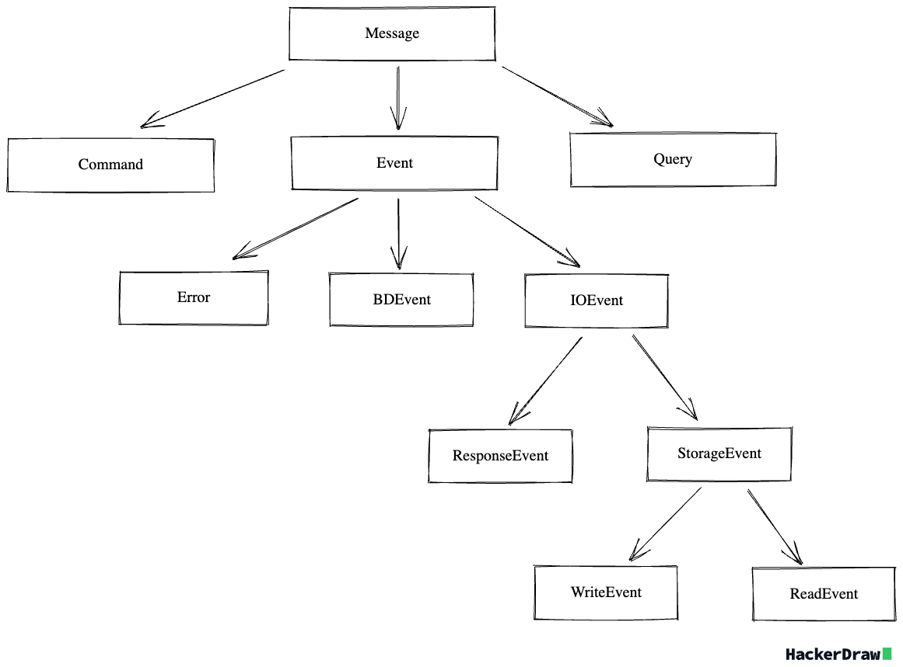

# Codex
Codex -  набор типов и интерфейсов для архитектуры современных приложений

## Подключение

```python
from zodchy import codex
```

## Состав

- **cqea**: набор интерфейсов для построения event driven CQRS архитектур 
- **query**: набор базовых типов для построения инструментов доступа к данным
- **di**: набор интерфейсов для реализации Dependency Injection
- **identity**: набор интерфейсов для реализации различных Identity

## СQEA
**Command Query Event Actor** - набор типов и интерфесов для построения реактивного приложения.

### Базовые типы

**Message** - базовая сущность переноса информации в системе. Ниже представлена иерархия типов сообщений



**Actor** - контракт сущности обработчика сообщения. Есть уточнения данного контракта, 
не находящиеся в отношениях наследования друг с другом:
- Domain Actor
- Write Actor
- Read Actor
- AuditActor

Уточненными контрактами можно пользоваться если есть необходимость задать более узкую зону ответственности актора

## Query
Набор контрактов-контейнеров для маркировки запросов к данным

- **FilterBit** -  фильтрация элементов набора данных
- **OrderBit** - сортировка элементов набора данных
- **SliceBit** - ограничение размера набора данных

Пример определения контракта запроса к данным:

```python
import dataclasses
import datetime

from zodchy.codex.query import (
    Query,
    FilterBit,
    OrderBit,
    SliceBit
)
from zodchy import operators

@dataclasses.dataclass
class GetUsers(Query):
    user_id: FilterBit[int] | None = None
    user_name: FilterBit[str] | OrderBit | None = None
    created_at: FilterBit[datetime.datetime] | OrderBit | None = None
    limit: SliceBit | None = None

# Form Query
get_users_query = GetUsers(
    user_id=FilterBit[int](operators.EQ(1)),
    user_name=FilterBit[str](operators.LIKE('jhon')) + OrderBit(1),
    created_at=OrderBit(2),
    limit=SliceBit(100)
)
```
В данном примере GetUsers представляет запрос к данным с 
- возможностью указания опционального фильтра по признакам user_id, user_name, created_at,
- опциональной сортировке итогового набора по признакам user_name, created_at с установкой приоритета,
- опционального указания максимального размера итогового набора данных

FilterBit является generic типом, в квадратных скобках указывает тип принимаемых значений.

В клиентском коде следует избегать необходимости формирования запроса-значения (get_users_query) вручную, 
лучше это делать через адаптеры.

Хочется подчеркнуть, что это максимально высокоуровневые контейнеры, которые можно интерпретировать 
в библиотеках работы с запросами как угодно. 

**NotationParser** - контракт для парсера запроса к данным в виде строки или набора токенов 

## DI

- **DIContainerContract** - контракт для реализации dependency injection контейнера
- **DIResolverContract** - контракт для реализации резолвера dependency injection

## Identity

- **IdentifiersFactory** - контракт для реализации фабрик по генерации различных идентификаторов.