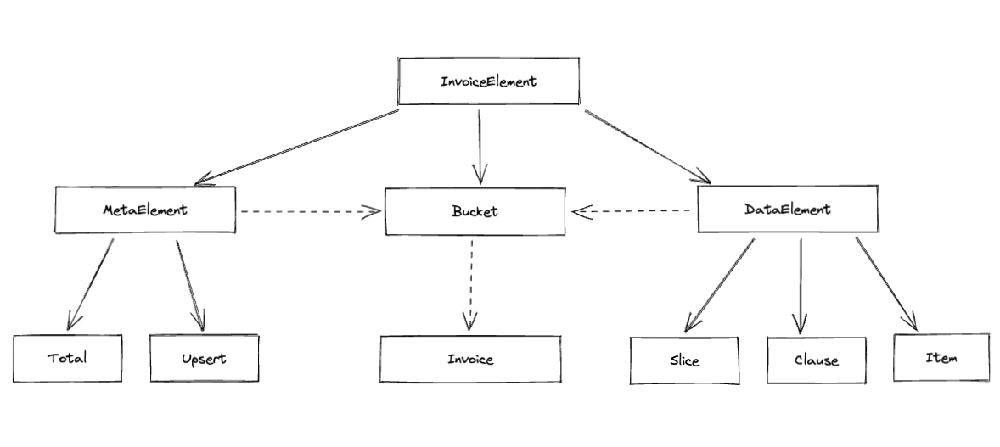

# Hermitage
Библиотека для работы с декларативными запросами к хранилищам данных. 

## Идея
Каждое хранилище данных предоставляет свой способ сформулировать запросы к этим данным. 
Это может быть старый добрый SQL, может быть чуть по новее, но не менее няшный JSON, 
а может быть и суровый проприетарный бинарный протокол или еще какой Redis API. 

Вот было бы здорово иметь возможность скрыть все эти сложности за единым уровнем абстракции, 
не заморачиваясь в процессе проектирования на конкретику хранилищ данных. 

В конце концов, когда мы делаем заказ в каком-нибудь интернет магазине, мы не задумываемся о том 
как у них устроены стеллажи с товарами и как бы нам максимально удобно сформулировать запрос, 
чтобы бегать между ними пришлось меньше. Мы просто накидываем в заказ позиции.

Библиотека hermitage как раз оперирует абстракциями реального мира для составления запросов к данным.

## Нотация

Давайте рассмотрим описание составных частей запроса данных и представления ответа,
которые составляют декларативную нотацию **hermitage**.

Диаграмма связей представлена на рисунке ниже



Здесь сплошные стрелки означат отношение наследования, пунктирные - включения внутрь контейнера.

### Invoice
Основной контейнер запроса, в нем задаются его составные части (позиции и ограничения)

```python
from hermitage.notation import Invoice

invoice = Invoice() # Пустой, бесполезный, но рабочий запрос
```

### Bucket
Логически - набор связанных между собой единиц хранения (Item, см. ниже подробности). 
Физически это может быть таблица в реляционной БД, коллекция в документоориентированной, s3 bucket, 
каталог на жестком диске и тд.

У бакета обязательно должно быть имя.

```python
from hermitage.notation import Invoice, Bucket

invoice = Invoice(
    Bucket("users")
) # Чуть более осмысленный и по-прежнему бесполезный, но рабочий запрос
```

Бакеты могут вкладываться друг в друга, декларируя свои отношения 

```python
from hermitage.notation import Invoice, Bucket

invoice = Invoice(
    Bucket(
        "users",
        Bucket(
            "articles",
            Bucket(
                "comments"
            )
        )
    )
)
```

Бакет может указать родительскому бакету в какой виртуальной единице хранения будут выводиться его результаты
```python
from hermitage.notation import Invoice, Bucket

invoice = Invoice(
    Bucket(
        "users",
        Bucket(
            "articles",
        ).label("user_articles")
    )
)
```

Бакет может указать родительскому бакету в каком контексте его нужно интепретировать при построении схемы отношений. 
Это полезно когда один и тот же бакет может нести разный семантический смысл. 
Например, нам надо запросить статьи с указанием автора и редактора. 
Но автор и редактор это наследники сущности пользователь и хранятся в одном бакете users. 
В таком случае мы легко можем выразить свои намерения, используя метод **qua** бакета.

```python
from hermitage.notation import Invoice, Bucket

invoice = Invoice(
    Bucket(
        "articles",
        Bucket(
            "users",
        ).qua("author"),
        Bucket(
            "users",
        ).qua("editor")
    )
)
```

qua и label можно комбинировать

```python
from hermitage.notation import Invoice, Bucket

invoice = Invoice(
    Bucket(
        "articles",
        Bucket(
            "users",
        ).qua("author").label("article_author"),
        Bucket(
            "users",
        ).qua("editor").label("article_editor"),
    )
)
```
Главное - понимать, что **qua** про семантику, а **label** про представление результата.

### Item
Основная единица хранения. Физически это может быть поле/строка в БД, файл на диске, поле/строка в текстовом файле и тд

```python
from hermitage.notation import Invoice, Bucket, Item

invoice = Invoice(
    Bucket(
        "articles",
        Item("id"),
        Item("title"),
        Item("content"),
        Bucket(
            "users",
            Item("id"),
            Item("name")
        ).qua("author"),
    )
) # Полностью осмысленный, полезный и рабочий запрос.
```

Так же Item может принимать словарь. Обычно, это полезно в инвойсах на запись (подробнее об этом чуть позднее)
```python
from hermitage.notation import Invoice, Bucket, Item

invoice = Invoice(
    Bucket(
        "articles",
        Item(
            dict(
                id=1,
                title="About the nature of things",
                content="WIP"
            )
        )
    )
)
```

### Clause
Элемент декларации некоторого условия. В SQL максимально близкие аналоги: WHERE, ORDER BY, GROUP BY

```python
import datetime
import zodchy
from hermitage.notation import (
    Invoice,
    Bucket,
    Item,
    Clause
)

invoice1 = Invoice(
    Bucket(
        "articles",
        Item("id"),
        Item("title"),
        Item("content"),
        Clause(
            "created_at", 
            zodchy.operators.GT(datetime.datetime(2024, 7, 1))
        )
    )
) # Выбрать все статьи созданные не позднее 1 июля 2024 годв

invoice2 = Invoice(
    Bucket(
        "articles",
        Item("id"),
        Item("title"),
        Item("content"),
        Clause(
            "created_at", 
            zodchy.operators.DESC()
        )
    )
) # Выбрать все статьи, отсортированные по дате создания начиная с самой новой
```

Clause элементы могут быть объедены логическими операторами 
(если это семантически оправданно, конечно. Нет смыла объединять условие ORDER и WHERE)

```python
import datetime
from zodchy.operators import EQ, GT, SET
from hermitage.notation import Clause

clause = (Clause("id", EQ(12)) | Clause("id", EQ(13))) & Clause("created_at", GT(datetime.datetime(2024,7,1))) 

# Первая часть условия в скобках показана для примера операции ИЛИ. В реальности она может быть заменена 
# на более подходящее: Clause("id", SET(12, 13))
```

### Slice
Элемент декларации способа нарезки итогового результата на порции
```python
import zodchy
from hermitage.notation import (
    Invoice,
    Bucket,
    Item,
    Slice
)

invoice1 = Invoice(
    Bucket(
        "articles",
        Item("id"),
        Item("title"),
        Item("content"),
        Slice(zodchy.operators.Limit(100)),
        Slice(zodchy.operators.Offset(10)),
    )
) # Выдать 100 статей, начиная с 10-ой
```

Основное отличие Slice от Clause, помимо очевидной семантики, отсутствие целевого параметра.

### MetaElement
Способ декларировать дополнительную информацию о данных. В рамках библиотеки определяются два мета элемента:

- Total - позволяет указать в запросе на необходимость вернуть вместе с результатом общее количество строк
- Upsert - позволяет указать в запросе что Item нужно или обновить или вставить (при отсутствии совпадений по условию)

```python
import zodchy
from hermitage.notation import (
    Invoice,
    Bucket,
    Item,
    Slice,
    Total,
    Upsert
)

invoice1 = Invoice(
    Bucket(
        "articles",
        Item("id"),
        Item("title"),
        Item("content"),
        Slice(zodchy.operators.Limit(10)),
        Total()
    )
) # Вернуть данные (10 записей) и рядом приложить общее их количество 

invoice2 = Invoice(
    Bucket(
        "articles",
        Item(
            dict(
                title="Hello",
            )
        ),
        Upsert(Clause("id", zodchy.operators.EQ(12)))
    )
) # Обновить запись с id=12, если такая не найдена - вставить
```

### View
Обертка для представления результата выборки данных

```python
from hermitage.notation import View

# Do some calulations

view = View(data=data, meta={'total': total})
```

## Адаптеры
Так как библиотека является частью zodchy стека, то в нее добавлен адаптер, 
который позволяет преобразовать [сущности CQEA архитектуры](../../base/codex.md#сqea) в hermitage нотацию, 
описанную выше.

```python
import zodchy
from hermitage.adapters import CQEA

# Определяем шаблон запроса, где мы можем опционально задать условие поиска по id и/или name и 
# также указать необходимость/порядок сортировки по name

class GetUsersQuery(zodchy.codex.cqea.Query):
    id: zodchy.codex.query.FilterBit[int] | None = None
    name: zodchy.codex.query.FilterBit[int] | zodchy.codex.query.OrderBit | None = None

# сам экземпляр запроса может выглядеть так
johns = GetUsersQuery(
    name=zodchy.operators.LIKE('john') + zodchy.operators.DESC(),
    id=zodchy.codex.query.GTE(10)
) # найдем всех Джонов и Джонни и прочих Джоанн, начиная с id=10 и отсортируем найденное по id от большего к меньшему 

# создаем экземпляр адаптера
adapter = CQEA()

# и скармливаем ему CQEA запрос

data_query = adapter(johns) # на выходе получаем генератор объектов DataElement 

print(list(data_query))
# >>> [
#     Clause(name='name', operation=zodchy.operators.LIKE('john)), 
#     Clause(name='id', operation=zodchy.operators.GTE(10)), 
#     Clause(name='name', operation=zodchy.operators.DESC())
#   ]
```
И дальше получившийся запрос можно передать следующему адаптеру, который переведет этот обобщенный запрос 
в конкретную форму определенного хранилища, к примеру [SqlAlchemy adapter](../../adapters/rdbs/sqlalchemy.md)

Может возникнуть резонный запрос - зачем вся эта цепочка преобразований? 
Ответ выходит за рамки описания библиотеки hermitage, но если вкратце - разделение зон ответственности. 
**zodchy.codex.cqea.Query** это сущности бизнес логики приложения, в процессе прохождения по бизнес процессу, 
эта сущность может несколько раз перерождаться, обрастая новыми условиями (например в процессе авторизационного аудита), 
чтобы в итоге прийти в слой хранения, где она будет отражена на конкретную комбинацию полей хранения. 

Описанный выше адаптер работает в простейшей ситуации когда поля сущности QUERY 1 в 1 
отображаются на поля сущности хранения. В остальных случаях придется писать ручное преобразование

Если же мы используем hermitage в проектах без CQEA, то данный адаптер можно и не изучать.

### Преобразователи
Преобразователь (transformer) - callable объект, применяемый к полю запроса. Обычно работает в связке с адаптером

Возьмем запрос из прошлого примера
```python
from hermitage.adapters.transformer import Replace

johns = GetUsersQuery(
    name=zodchy.operators.LIKE('john') + zodchy.operators.DESC(),
    id=zodchy.codex.query.GTE(10)
)

# предположим, что у нас в хранилище поменялось название поля в БД c name на user_name, 
# но мы не хотим из-за этого менять бизнес сущности запроса GetUsersQuery (и не надо, для этого весь этот bicycle race и задумывался),
# поэтому, мы просто добавим в адаптер трансформер Rreplace 

adapter = CQEA()
data_query = adapter(johns, Replace(search_field='name', replace_field="user_name"))

# и на выходе получим соответствующий Clause(name="user_name", operation=zodchy.operators.LIKE('john)). Победа
```

А теперь предположим что изощренный вирус разделил на 2 все четные id наших пользователей. 
Человек с ключами от базы заперся в туалете и плачет, а нам надо решить вопрос. 
И снова на помощь приходит трансформер Replace

```python
# Определяем функцию которая будет работать со значениями поля
def double(x: zodchy.codex.query.FilterBit[int]) -> zodchy.codex.query.FilterBit[int]:
    return type(x)(x.value * 3)

adapter = CQEA()

# здесь мы не меняем название поля, поэтому replace_field не нужен, просто указываем callable сущность, 
# которая будет применена к значениям поля, если такие будут в запросе
data_query = adapter(johns, Replace(search_field="id", replace_entity=double))
```

Можно писать свои адаптеры, контракт есть в definitions/contracts/adapters.py